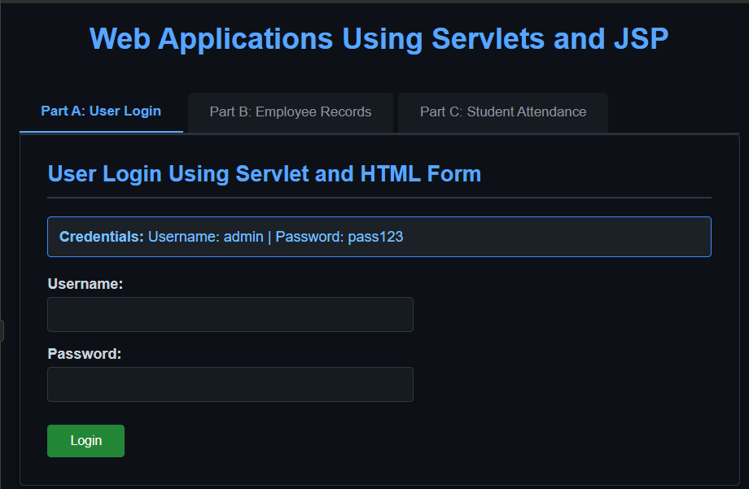
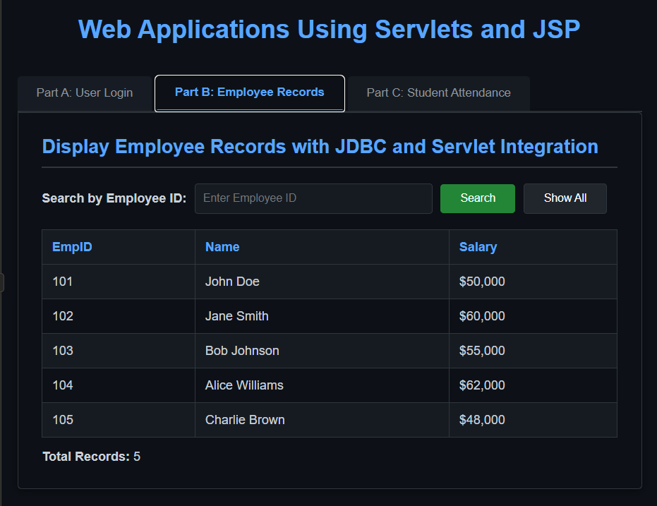
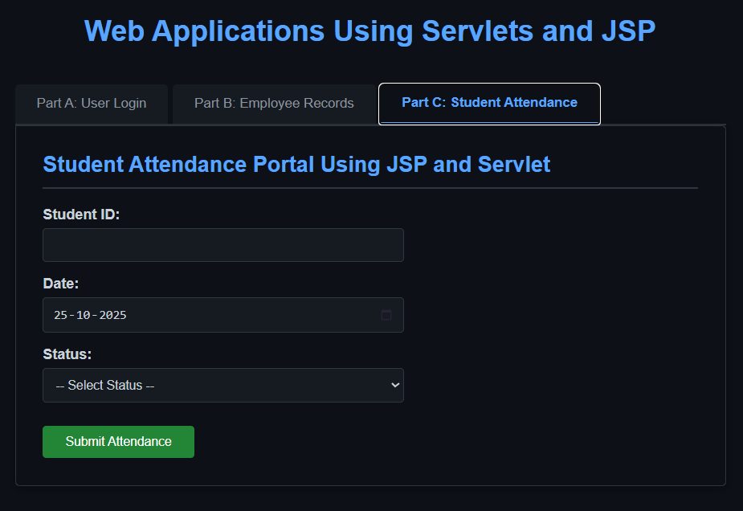

# Servlet_JSP_Applications

This repository contains a simple frontend demo (single-page HTML) that illustrates three parts commonly used with Servlet/JSP projects:

- Part A: User Login (client-side demo)
- Part B: Employee Records (static data table)
- Part C: Student Attendance (client-side attendance storage)

## 💻 Project Output

### 🖥️ Part A: User Login

### 🧾 Part B: Employee Records

### 🎓 Part C: Student Attendance

